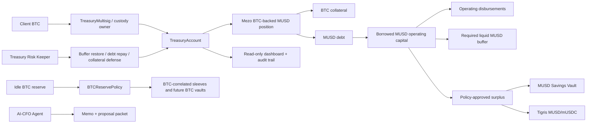
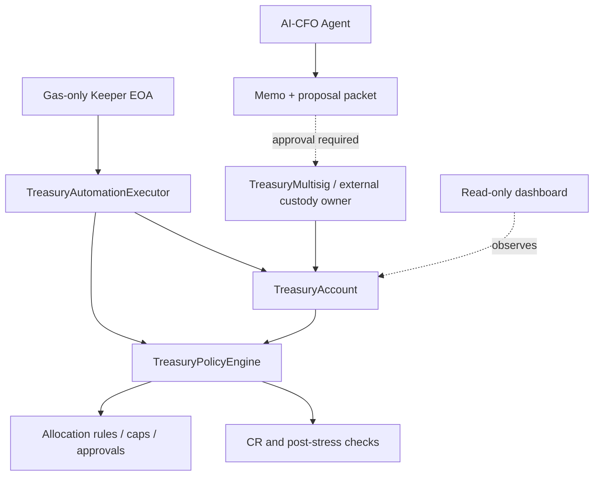

<h1 align="center">Mezo TreasuryOS</h1>

<p align="center">
  <strong>Policy-governed BTC treasury operations on Mezo.</strong>
</p>

<p align="center">
  <a href="https://testnet.mezo.org/"></a>
  <a href="#submission-snapshot"></a>
  <a href="#dashboard"></a>
  <a href="#ai-cfo-agent"></a>
  <a href="./LICENSE"></a>
</p>

Mezo lets Bitcoin holders borrow MUSD without selling BTC. **TreasuryOS** turns that borrowing rail into an institutional treasury workflow: isolated client Treasury Accounts, TreasuryOS-native multisig controls, MUSD operating buffers, approved allocation into Mezo-native sleeves, policy-capped keeper defense, AI-CFO reporting, and explorer-verifiable audit trails.

> The agent is not trusted. The policy is trusted.

[Live Demo](#live-demo) • [Submission Snapshot](#submission-snapshot) • [Quick Start](#quick-start) • [System Schema](#system-schema) • [Documentation](#documentation) • [Roadmap](#from-hackathon-prototype-to-treasury-platform)

---

## TL;DR

TreasuryOS demonstrates a full BTC treasury workflow on Mezo testnet:

- BTC collateral backs a live Mezo MUSD position.
- Borrowed MUSD lands inside a client-isolated `TreasuryAccount`.
- The treasury can use part of the borrowed MUSD for operations while preserving a required liquid buffer.
- Only policy-approved surplus MUSD can route into Mezo-native sleeves such as MUSD Savings.
- Sensitive actions remain controlled by a TreasuryOS-native `TreasuryMultisig` today, with external custody or contract-wallet owners supported as a production path.
- `TreasuryAutomationExecutor` allows a gas-only keeper to execute only whitelisted, capped defensive actions.
- An AI-CFO Agent reads deterministic state, explains tradeoffs, and prepares proposal packets without signing or custody.
- A read-only dashboard shows one institutional tenant workspace, policy decisions, and audit trail proof.

TreasuryOS is **not** a custody provider, not a generic dashboard, and not a proprietary yield protocol. It is the treasury operating layer on top of Mezo’s BTC-backed MUSD capital rail.

---

## Live Demo

- **Dashboard:** [`mezo-treasuryos.vercel.app`](https://mezo-treasuryos.vercel.app)
- **Local dashboard:** `make dashboard-data && make dashboard-dev`
- **Network:** Mezo Testnet / chain ID `31611`
- **Primary proof command:** `make scenario-proof`
- **Deployment record:** [`docs/MEZO_TESTNET_DEPLOYMENT.md`](docs/MEZO_TESTNET_DEPLOYMENT.md)
- **Final runbook:** [`docs/FINAL_DEMO_RUNBOOK.md`](docs/FINAL_DEMO_RUNBOOK.md)

The hosted dashboard is a read-only one-tenant demo workspace generated from TreasuryOS CLI snapshots and public Mezo testnet contract data. It does not hold keys, request signatures, or broadcast transactions.

---

## Why This Matters

Mezo makes it possible to unlock MUSD liquidity against BTC.

That is the capital rail.

A serious treasury still needs:

- internal controls
- approval workflows
- liquidity buffer management
- governed deployment of idle MUSD
- automated treasury operations
- collateral-health and liquidation-risk management
- accounting and reviewer-facing reporting

Without that layer, BTC-backed working capital remains a loose mix of protocol actions, wallet flows, manual approvals, and spreadsheets.

**TreasuryOS turns Mezo’s BTC-backed borrowing into a treasury workflow.**

---

## Built For

**Mezo Hackathon — Bank on Bitcoin / Bitcoin Track**

Primary focus area:

- **BTC Treasury Management & Institutional Services**

Secondary fit:

- **Borrowing & Leverage on BTC** — collateral health, repayment, and liquidation-defense controls
- **Bitcoin Yield & Investment** — policy-governed MUSD Savings, Tigris sleeve evaluation, and guarded BTC-yield planning
- **Paying & Receiving BTC on Mezo** — future x402-paid treasury intelligence and reporting APIs

Track alignment:

| Focus | TreasuryOS implementation |
| --- | --- |
| Corporate treasury solutions | Client-isolated Treasury Accounts with BTC collateral, MUSD debt, operating buffers, and allocation controls |
| Institutional custody integration | TreasuryOS-native `TreasuryMultisig` today; external custody / contract-wallet ownership path supported |
| Accounting and reporting tools | Read-only dashboard, CLI snapshots, audit trail, Goldsky scaffold |
| Compliance/control infrastructure | `TreasuryPolicyEngine`, approval checks, caps, policy decision traces |
| Multi-sig treasury management | Client `TreasuryMultisig` owns the live TreasuryAccount |
| Automated treasury operations | `TreasuryAutomationExecutor` plus gas-only keeper with whitelisted, capped defense actions |
| Robo-advisors for Bitcoin portfolios | AI-CFO Agent writes advisory memos and proposal packets from deterministic state |
| Risk management tools | Projected CR checks, post-stress CR, defense-capacity model, blocked BTC sleeve decisions |

---

## Submission Snapshot

| Area | Status |
| --- | --- |
| Mezo testnet deployment | Live |
| MUSD integration | Live |
| BTC-backed MUSD position | Live |
| Client `TreasuryAccount` | Live |
| TreasuryOS-native `TreasuryMultisig` ownership | Live |
| `TreasuryAutomationExecutor` | Live; keeper allowlisted and capped |
| MUSD Savings allocation | Live |
| Keeper buffer restoration | Live transaction |
| Keeper idle-MUSD debt repayment | Live transaction |
| Critical de-risk action | Proposal calldata, not executed on tiny live position |
| AI-CFO Agent | Implemented; advisory/proposal-only |
| Dashboard | Read-only one-tenant workspace |
| Spectrum RPC path | Preferred and reported by health checks |
| Goldsky | Scaffolded for reporting/indexing |
| Protocol fees | Deployed, disabled, not wired into treasury execution |
| Tigris MUSD/mUSDC sleeve | Contract-ready; route-health dependent on current testnet liquidity |
| Tigris mcbBTC/BTC sleeve | Guarded BTC-correlated yield candidate; blocked in the current testnet demo until liquidity, price-impact, and tiny broadcast validation are acceptable |

Detailed BTC sleeve policy and testnet liquidity notes are documented in [`docs/BTC_RESERVE_AND_YIELD_SLEEVES.md`](docs/BTC_RESERVE_AND_YIELD_SLEEVES.md).

---

## What Is Live vs Guarded

### Live in the current demo

- One multisig-owned client `TreasuryAccount`
- BTC collateral deposited through TreasuryOS
- Live MUSD position opened on Mezo testnet
- MUSD allocated into MUSD Savings through `TreasuryAccount.allocate`
- Policy proof for blocked unsafe or over-threshold actions
- `TreasuryAutomationExecutor` configured for the client treasury
- Keeper restore-buffer transaction through the executor
- Keeper idle-MUSD debt-repayment transaction through the executor
- AI-CFO opportunity review and advisory memo
- Read-only dashboard generated from sanitized snapshots and public testnet data

### Guarded, future, or production expansion

- Production mainnet deployment with stronger protocol-admin, owner, and custody controls
- External custody / contract-wallet proposal export for institutional approval workflows
- Goldsky-backed event history and durable audit timeline
- Broader Mezo ecosystem allocation coverage as reliable MUSD and BTC yield surfaces become available
- Additional external BTC vault integrations on mainnet when accessible
- BTC-denominated sleeve execution after controlled validation of liquidity, price impact, receipt accounting, and unwind paths
- BTC lock / staking-style positions where withdrawal constraints and principal immobility are explicitly modeled
- LP staking and reward-claim support for validated Tigris positions
- Client-specific AI-CFO agents with monitor, proposer, reporter, and keeper roles
- x402-gated treasury intelligence APIs for paid AI-CFO reports, risk snapshots, audit packs, and accounting exports
- MEZO/MUSD subscription credits for monitoring, reporting, and premium treasury analytics

---

## How TreasuryOS Works

TreasuryOS owns the workflow layer, while Mezo owns the native capital rail.

```text
BTC collateral
  → Mezo-backed MUSD position
  → borrowed MUSD in TreasuryAccount
  → operating use + required liquidity buffer
  → policy-governed surplus allocation
  → keeper defense
  → AI-CFO reporting and audit trail
```

Core sequence:

1. A treasury creates an isolated `TreasuryAccount`.
2. The account is owned by a TreasuryOS-native `TreasuryMultisig` in the demo, or by an external custody / contract-wallet owner in production.
3. The treasury opens a Mezo BTC-backed MUSD position through TreasuryOS.
4. Borrowed MUSD lands inside the Treasury Account.
5. Part of the borrowed MUSD can be used for operating needs through the treasury control path.
6. Policy preserves a required liquid MUSD operating buffer.
7. Approved surplus can route into Mezo-native sleeves.
8. Keeper actions remain bounded to defensive workflows.
9. AI-CFO prepares memos and proposals without custody or signing.
10. Dashboard and CLI outputs provide reviewer-facing reporting.

---

## System Schema

### Capital workflow



### Control boundary



Detailed schema: [`docs/SYSTEM_SCHEMA.md`](docs/SYSTEM_SCHEMA.md)

---

## Architecture

TreasuryOS has three layers.

### 1. Onchain treasury control layer

- `TreasuryAccountFactory`
- `TreasuryAccount`
- `TreasuryPolicyEngine`
- `TreasuryMultisig`
- `TreasuryAutomationExecutor`
- `AllocationRouter`
- `MUSDSavingsRateHandler`
- `TigrisStablePoolHandler`
- `BTCReservePolicy`
- disabled fee infrastructure

### 2. Offchain treasury operations layer

- Spectrum-backed state reads
- treasury snapshots
- Yield Console
- Treasury Risk Keeper
- AI-CFO Agent
- term-yield planner
- BTC sleeve planner
- Goldsky scaffold

### 3. Product interface layer

- read-only dashboard
- CLI proof flows
- audit trail
- reporting output
- proposal calldata views

Full architecture: [`docs/ARCHITECTURE.md`](docs/ARCHITECTURE.md)

---

## Key Control Boundaries

TreasuryOS is designed so automation and AI do not become uncontrolled execution authority.

| Actor / component | Can do | Cannot do |
| --- | --- | --- |
| AI-CFO Agent | Read state, rank opportunities, write memos, prepare proposal packets | Sign, custody, broadcast, bypass policy |
| Keeper EOA | Pay gas for whitelisted defensive executor calls | Receive treasury assets, execute arbitrary withdrawals |
| TreasuryMultisig / custody owner | Execute sensitive treasury actions | Replace policy checks where the account enforces them |
| TreasuryPolicyEngine | Enforce limits, caps, approval requirements, risk checks | Custody funds |
| TreasuryAutomationExecutor | Route whitelisted defensive calls after policy validation | Execute arbitrary treasury actions |
| Dashboard | Display state, proof, links, and policy traces | Request signatures or broadcast transactions |

---

## Quick Start

### Requirements

- Node.js
- Foundry (`forge`, `cast`, `anvil`)
- Make
- Mezo testnet RPC configuration in `.env`

### Install

```bash
make install
```

### Build and test

```bash
make build
make test
```

### Check Mezo RPC health

```bash
make rpc-health
```

### Run final proof commands

```bash
make demo-status
make scenario-proof
make advisor-cfo
make advisor-opportunities
make yield-console-demo
make risk-keeper-demo
make risk-keeper-propose-critical
```

### Run the dashboard locally

```bash
make dashboard-data
make dashboard-vercel-check
make dashboard-dev
```

The public demo flow is wrapped in `make` targets. Lower-level package scripts exist for service-specific development, but the reviewer path should use the commands above.

---

## Demo Commands

| Command | Purpose |
| --- | --- |
| `make demo-status` | Prints live demo readiness: RPC, sleeves, keeper, fees, BTC sleeve boundary |
| `make scenario-proof` | Main read-only scenario matrix with deployed addresses, state, policy proof, keeper txs, AI-CFO summary |
| `make advisor-cfo` | Generates the AI-CFO recommendation/memo flow from deterministic state |
| `make advisor-opportunities` | Shows ranked opportunities and blocked reasons |
| `make yield-console-demo` | Shows buffer, allocatable surplus, sleeve exposure, and policy posture |
| `make risk-keeper-demo` | Shows keeper state and deterministic recommendation |
| `make risk-keeper-propose-critical` | Prints critical sleeve-funded repayment proposal calldata |
| `make dashboard-data` | Generates sanitized dashboard snapshot data |
| `make dashboard-vercel-check` | Builds/scans the dashboard for static hosting readiness |
| `make dashboard-dev` | Starts the local read-only dashboard |

---

## Deployed Mezo Testnet Stack

Current active deployment: Mezo Testnet, chain ID `31611`.

### Protocol core

| Contract | Address |
| --- | --- |
| `TreasuryPolicyEngine` | [`0xe437...cC2e7`](https://explorer.test.mezo.org/address/0xe43737328BB3C20bE484B1376F931391062cC2e7) |
| `BTCReservePolicy` | [`0x4d60...afAe`](https://explorer.test.mezo.org/address/0x4d6054bb0BFDEcBDA3599681EfEa383c1F63afAe) |
| `TreasuryAccount` implementation | [`0xCc54...BB36`](https://explorer.test.mezo.org/address/0xCc54C379A3f6A410BFC2cCeeB947953E1DD8BB36) |
| `TreasuryAccountFactory` | [`0xC28e...AcD2`](https://explorer.test.mezo.org/address/0xC28e6f7C166b2bDa783AF9f0DD864147aFE0AcD2) |

### Client treasury

| Contract | Address |
| --- | --- |
| Client `TreasuryMultisig` | [`0x25a1...Be3`](https://explorer.test.mezo.org/address/0x25a1FA3cF0597468eB35539712243d9e7B6FDBe3) |
| `TreasuryAccount` clone | [`0xaB79...7ac7`](https://explorer.test.mezo.org/address/0xaB79775A1995AD280B2A32cB0127734eEa677ac7) |
| `TreasuryAutomationExecutor` | [`0xD5b3...25bF`](https://explorer.test.mezo.org/address/0xD5b3Bc3515aEA5A94b997B0525a4B510E71d25bF) |
| `AllocationRouter` | [`0xf6FC...338E`](https://explorer.test.mezo.org/address/0xf6FC1ff6c6eE770Ff3e6A1f99B3DdD668538338E) |
| `MUSDSavingsRateHandler` | [`0x801E...c0fF`](https://explorer.test.mezo.org/address/0x801E185bCB70705B3CF3494caca948b6C48bc0fF) |
| `TigrisStablePoolHandler` | [`0x4B76...E785`](https://explorer.test.mezo.org/address/0x4B761376fE6ABb6Fc00138217B3d7656c82FE785) |

### Fee infrastructure

Fee contracts are deployed for future monetization but disabled for the hackathon demo.

| Contract | Address |
| --- | --- |
| `ProtocolFeeVault` | [`0x78c2...EE3d`](https://explorer.test.mezo.org/address/0x78c29c1A7BE2cd2F770AC88DF7a169aD3910EE3d) |
| `ProtocolFeeManager` | [`0x5227...a019`](https://explorer.test.mezo.org/address/0x5227B80cb9D23d0004e947777782fe9EB13Fa019) |

Full deployment details: [`docs/MEZO_TESTNET_DEPLOYMENT.md`](docs/MEZO_TESTNET_DEPLOYMENT.md)

---

## Live Transaction Proof

Explorer-verifiable transaction proof is available in the hosted dashboard audit trail and
[`docs/FINAL_DEMO_RUNBOOK.md`](docs/FINAL_DEMO_RUNBOOK.md). The detailed runbook includes the live borrow, MUSD
Savings allocation, keeper buffer restoration, and keeper debt-repayment transactions plus interpretation notes for the
AllocationRouter internal dispatch path.

---

## Dashboard

The dashboard is a read-only **Client Treasury Workspace**.

It shows:

- tenant data snapshot
- BTC and MUSD balance sheet
- current and post-stress collateral health
- policy and control boundaries
- keeper recommendation and critical proposal calldata
- AI-CFO Agent memo and prepared proposal packet
- MUSD allocation/yield console
- policy decision trace
- audit trail with explorer-verifiable transaction proof
- data and infrastructure status

Run locally:

```bash
make dashboard-data
make dashboard-dev
```

Static hosting check:

```bash
make dashboard-vercel-check
```

For Vercel:

- Root Directory: `dashboard`
- Framework Preset: `Other`
- Build Command: `npm run build`
- Output Directory: `dist`

Do not configure private keys, keeper keys, OpenAI keys, or private RPC URLs in the hosted dashboard.

---

## AI-CFO Agent

TreasuryOS includes an AI-CFO workflow without trusting AI with treasury funds.

The AI-CFO Agent combines deterministic TreasuryOS state with optional premium LLM memo generation. The deterministic advisor computes the facts: treasury state, policy results, opportunity ranking, blocked reasons, and proposal details. The LLM layer turns those facts into an investment-committee-style memo for treasury operators.

The model can explain and prepare. It cannot sign, custody, broadcast, or bypass policy.

The AI-CFO Agent:

- reads TreasuryAccount state, BTC collateral, MUSD debt, idle MUSD, sleeve allocations, and reserve buckets
- reads live Mezo opportunities such as MUSD Savings, Tigris MUSD/mUSDC, and mcbBTC/BTC
- ranks opportunities by policy fit, liquidity, route health, risk class, approval requirement, and execution readiness
- writes treasury admin / investment committee memos
- prepares proposal packets and calldata helpers
- explains blocked opportunities

It cannot:

- hold keys
- custody BTC or MUSD
- execute arbitrary swaps
- bypass policy
- move BTC principal without owner or multisig approval

More: [`docs/AI_CFO_AGENT.md`](docs/AI_CFO_AGENT.md)

---

## Treasury Risk Keeper

TreasuryOS protects the BTC-backed MUSD position before chasing yield.

The V1 keeper supports:

- projected collateral-ratio checks
- post-stress collateral-ratio checks
- weighted defense-capacity modeling
- idle-MUSD debt repayment
- MUSD Savings buffer restoration
- sleeve-funded de-risk proposal calldata
- guarded idle-BTC collateral top-up path
- gas-only keeper execution through `TreasuryAutomationExecutor`

The keeper can execute only whitelisted, capped defensive actions after policy validation.

More: [`docs/TREASURY_RISK_KEEPER.md`](docs/TREASURY_RISK_KEEPER.md)

---

## BTC Reserve And Yield Boundary

TreasuryOS separates:

- **MUSD operating capital:** borrowed working capital that must preserve a liquid MUSD buffer.
- **BTC-denominated treasury exposure:** idle BTC reserve, BTC collateral, and future BTC-correlated yield positions.

The real Tigris `mcbBTC/BTC` pool is treated as a BTC-correlated sleeve candidate, not a normal MUSD allocation route. The current product correctly blocks it when shallow liquidity, price impact, reserve floors, or validation status make execution unsafe.

More: [`docs/BTC_RESERVE_AND_YIELD_SLEEVES.md`](docs/BTC_RESERVE_AND_YIELD_SLEEVES.md)

---

## Documentation

Start here:

- [`docs/SYSTEM_SCHEMA.md`](docs/SYSTEM_SCHEMA.md) — product flow, capital buckets, control boundaries, and demo-proven scenario map
- [`docs/FINAL_DEMO_RUNBOOK.md`](docs/FINAL_DEMO_RUNBOOK.md) — exact final demo flow and proof commands
- [`docs/MEZO_TESTNET_DEPLOYMENT.md`](docs/MEZO_TESTNET_DEPLOYMENT.md) — active deployed contracts, tx proof, and source verification notes
- [`docs/ARCHITECTURE.md`](docs/ARCHITECTURE.md) — full technical architecture
- [`docs/TREASURY_RISK_KEEPER.md`](docs/TREASURY_RISK_KEEPER.md) — bounded automation and defense model
- [`docs/AI_CFO_AGENT.md`](docs/AI_CFO_AGENT.md) — advisory agent model and guardrails
- [`docs/BTC_RESERVE_AND_YIELD_SLEEVES.md`](docs/BTC_RESERVE_AND_YIELD_SLEEVES.md) — BTC sleeve policy and testnet liquidity boundary
- [`docs/PROTOCOL_FEES.md`](docs/PROTOCOL_FEES.md) — zero-default fee architecture and future monetization model
- [`docs/DEPLOYMENT.md`](docs/DEPLOYMENT.md) — deployment modes and ownership paths
- [`docs/ROADMAP.md`](docs/ROADMAP.md) — post-hackathon product roadmap

Planning and pitch drafts should stay outside the public docs set so the submitted repo stays focused.

---

## Repo Structure

```text
mezo-treasuryos/
├─ config/
├─ contracts/
│  ├─ src/
│  │  ├─ adapters/
│  │  ├─ core/
│  │  ├─ external/
│  │  ├─ fees/
│  │  ├─ interfaces/
│  │  ├─ multisig/
│  │  └─ recovery/
│  ├─ script/
│  ├─ test/
│  └─ foundry.toml
├─ dashboard/
│  ├─ public/
│  │  ├─ data/
│  │  └─ src/
│  └─ scripts/
├─ services/
│  ├─ btc-sleeve-planner/
│  ├─ scenario-proof/
│  ├─ spectrum-state/
│  ├─ treasury-advisor/
│  ├─ treasury-risk-keeper/
│  ├─ term-yield-planner/
│  └─ yield-console/
├─ indexer/
│  └─ goldsky/
├─ deployments/
├─ docs/
├─ Makefile
└─ README.md
```

---

## From Hackathon Prototype To Treasury Platform

TreasuryOS can grow from a one-tenant Mezo testnet workflow into a treasury platform for BTC-backed operating capital.

| Horizon | Expansion | Product value | Boundary |
| --- | --- | --- | --- |
| V1.1 | Hosted report packs and client dashboard sharing | Makes TreasuryOS usable in treasury reviews and diligence | Read-only |
| V1.1 | Advisor what-if planning | Lets teams compare allocation/repayment choices before moving funds | Deterministic and policy-backed |
| V1.5 | External custody / contract-wallet proposal export | Fits institutional approval workflows | Client owner still approves |
| V1.5 | Goldsky-backed audit timeline | Durable accounting and reviewer history | Indexes real events only |
| V1.5 | Mezo ecosystem expansion | Adds more MUSD/BTC opportunities as they become reliable | Route/liquidity validation required |
| V2 | BTC vault and lock/staking integrations | Extends Bitcoin yield/investment surface | Separate BTC accounting and withdrawal constraints |
| V2 | Client-specific AI-CFO agents | Personalized monitoring, memos, and proposal generation | No custody/signing by AI |
| V2 | x402-paid treasury intelligence | Paid reports, risk APIs, audit packs, agent-readable snapshots | Payments gate intelligence, not funds |

### Future: x402-paid treasury intelligence

TreasuryOS can extend into Mezo’s payments theme through x402-gated AI-CFO reports, risk snapshots, audit packs, accounting exports, and agent-readable treasury APIs.

The important boundary: **x402 gates intelligence and reporting, not custody or emergency execution.**

Client BTC, MUSD, receipt tokens, and LP positions remain controlled by the Treasury Account owner, external custody path, TreasuryMultisig, and bounded keeper executor.

Full roadmap: [`docs/ROADMAP.md`](docs/ROADMAP.md)

---

## What TreasuryOS Does Not Claim

TreasuryOS does not claim to be:

- a custody provider
- a replacement for Mezo’s core borrow infrastructure
- a replacement for institutional custody onboarding
- a generic DeFi yield optimizer
- an autonomous AI trader
- a production-ready BTC sleeve allocator
- a production financial advisor

V1 is a working Mezo testnet product prototype that proves the institutional treasury workflow and control architecture.

---

## Final Takeaway

**TreasuryOS makes Mezo’s BTC-backed MUSD capital rail operationally usable for serious treasuries.**

It gives Mezo-native BTC holders a governed way to borrow, preserve liquidity, allocate surplus MUSD, defend the position, and produce treasury-grade reporting — without selling BTC and without trusting an AI agent with funds.

---

## License

MIT — see [`LICENSE`](./LICENSE)
