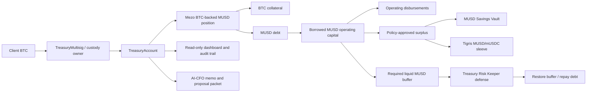
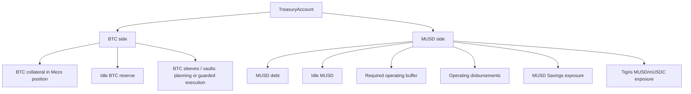
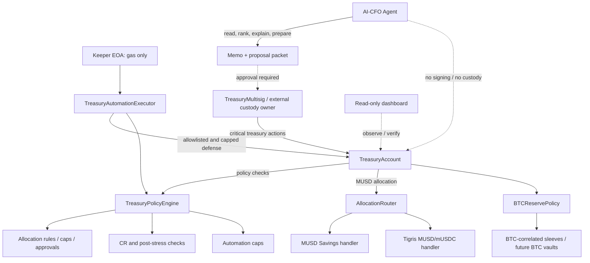

# TreasuryOS System Schema

This document is the compact reviewer-facing view of the current **Mezo TreasuryOS** V1 demo stack.

TreasuryOS is a one-tenant institutional treasury workspace on Mezo testnet. It starts with BTC-backed MUSD borrowing, then governs how borrowed MUSD is used for operations, buffered for safety, allocated into approved sleeves, defended by bounded automation, explained by AI-CFO, and reported through an audit trail.

> The agent is not trusted. The policy is trusted.

---

## Product Flow

Core sequence:

1. Client controls a treasury owner path: TreasuryOS-native `TreasuryMultisig`, external custody, or another contract-wallet owner.
2. Treasury owner controls one isolated `TreasuryAccount`.
3. `TreasuryAccount` opens and owns the Mezo BTC-backed MUSD position.
4. Borrowed MUSD lands inside the Treasury Account.
5. Part of the borrowed MUSD may be used for operating disbursements through the treasury control path.
6. Policy preserves a required liquid MUSD operating buffer.
7. Only approved surplus MUSD can route through `AllocationRouter` into approved sleeves.
8. Keeper can run bounded defensive actions only through `TreasuryAutomationExecutor`.
9. AI-CFO reads deterministic state and policy results, then writes memos and proposal packets.
10. Dashboard presents the same state as a read-only operator/reviewer console.

---

## Capital Buckets

TreasuryOS intentionally separates MUSD operating capital from BTC-denominated treasury exposure.

Why this matters:

- MUSD sleeves manage borrowed working capital and must preserve the liquid operating buffer.
- BTC collateral protects the Mezo borrow position.
- Idle BTC reserve is not the same thing as allocatable MUSD surplus.
- BTC-correlated or BTC-vault strategies require separate BTC accounting, reserve floors, receipt tracking, and elevated approval.

---

## Control Boundary

Control rules:

- AI-CFO does not sign, custody, broadcast, or bypass policy.
- Keeper EOA holds native BTC for gas only and never receives treasury assets.
- `TreasuryAutomationExecutor` exposes only whitelisted, capped defensive functions.
- Sensitive actions remain with the client owner path.
- Emergency defense is not fee-charged.
- Fees are deployed for future monetization but disabled in the hackathon demo.
- Dashboard is a read-only operator/reviewer surface.

---

## Deployed V1 Components

| Layer | Components | Demo status |
| --- | --- | --- |
| Client isolation | `TreasuryAccountFactory`, `TreasuryAccount` clone | Live on Mezo testnet |
| Client control | one-signer `TreasuryMultisig` | Live demo owner path |
| Policy | `TreasuryPolicyEngine`, `BTCReservePolicy` | Live checks and caps |
| Borrow | `TreasuryAccount.openTrove`, repay, collateral paths | Live position opened |
| MUSD allocation | `AllocationRouter`, `MUSDSavingsRateHandler` | Live Savings allocation |
| Optional Tigris MUSD sleeve | `TigrisStablePoolHandler` for MUSD/mUSDC | Contract-ready, route-health dependent |
| BTC-correlated sleeve | `BTCReserveRouter`, `TigrisBTCStablePoolHandler` for mcbBTC/BTC | Guarded V1.5 path; not core final execution |
| Automation | `TreasuryAutomationExecutor`, Treasury Risk Keeper | Live restore and debt repayment txs |
| AI-CFO | deterministic advisor plus optional OpenAI memo | Advisory/proposal-only |
| Fees | `ProtocolFeeVault`, `ProtocolFeeManager` | Deployed, disabled, not wired into execution |
| Reporting | CLI proof, static dashboard, Goldsky scaffold | Dashboard and CLI ready |

---

## Demo-Proven Scenarios

| Scenario | Proof posture |
| --- | --- |
| Onboard one multisig-owned client treasury | Live deployment |
| Open BTC-backed MUSD position through TreasuryOS | Live transaction |
| Allocate MUSD to Savings through `TreasuryAccount.allocate` | Live transaction |
| Preserve idle MUSD buffer | Live state |
| Block unsafe or over-threshold action | Replay/proof output |
| Keeper restore buffer from Savings | Live keeper transaction |
| Keeper repay debt from idle MUSD | Live keeper transaction |
| Critical sleeve-funded de-risk action | Proposal calldata, not executed on tiny live position |
| AI-CFO opportunity analysis | Live opportunity read plus deterministic memo |
| Tigris mcbBTC/BTC evaluation | Blocked in current testnet demo due to shallow liquidity, high quote impact, and unvalidated tiny broadcast path |

## Explorer Proof

Active Mezo testnet stack:

| Component | Address |
| --- | --- |
| TreasuryPolicyEngine | [`0xe437...cC2e7`](https://explorer.test.mezo.org/address/0xe43737328BB3C20bE484B1376F931391062cC2e7) |
| BTCReservePolicy | [`0x4d60...afAe`](https://explorer.test.mezo.org/address/0x4d6054bb0BFDEcBDA3599681EfEa383c1F63afAe) |
| TreasuryAccount implementation | [`0xCc54...BB36`](https://explorer.test.mezo.org/address/0xCc54C379A3f6A410BFC2cCeeB947953E1DD8BB36) |
| TreasuryAccountFactory | [`0xC28e...AcD2`](https://explorer.test.mezo.org/address/0xC28e6f7C166b2bDa783AF9f0DD864147aFE0AcD2) |
| Client TreasuryMultisig | [`0x25a1...Be3`](https://explorer.test.mezo.org/address/0x25a1FA3cF0597468eB35539712243d9e7B6FDBe3) |
| TreasuryAccount clone | [`0xaB79...7ac7`](https://explorer.test.mezo.org/address/0xaB79775A1995AD280B2A32cB0127734eEa677ac7) |
| TreasuryAutomationExecutor | [`0xD5b3...25bF`](https://explorer.test.mezo.org/address/0xD5b3Bc3515aEA5A94b997B0525a4B510E71d25bF) |
| AllocationRouter | [`0xf6FC...338E`](https://explorer.test.mezo.org/address/0xf6FC1ff6c6eE770Ff3e6A1f99B3DdD668538338E) |
| MUSD Savings handler | [`0x801E...c0fF`](https://explorer.test.mezo.org/address/0x801E185bCB70705B3CF3494caca948b6C48bc0fF) |
| ProtocolFeeVault | [`0x78c2...EE3d`](https://explorer.test.mezo.org/address/0x78c29c1A7BE2cd2F770AC88DF7a169aD3910EE3d) |
| ProtocolFeeManager | [`0x5227...a019`](https://explorer.test.mezo.org/address/0x5227B80cb9D23d0004e947777782fe9EB13Fa019) |

Live transaction proof:

| Proof | Tx |
| --- | --- |
| Open BTC-backed MUSD position | [`0xe0fe...c21a`](https://explorer.test.mezo.org/tx/0xe0fe153b870514833ca3962bd38052cc2fbbd3ab659d298c0f3604614905c21a) |
| Allocate MUSD to Savings through `TreasuryAccount.allocate` | [`0x7e73...d96b`](https://explorer.test.mezo.org/tx/0x7e730bb74b46b20585890124a458aa0fe7d4414caf1cac83e0826061f4ebd96b) |
| Keeper restores buffer from MUSD Savings | [`0x8800...87be`](https://explorer.test.mezo.org/tx/0x88006ce0bdbb0c1e433b9df31f99d11b85ccd2e0cd89e4e059112d88bf7087be) |
| Keeper repays debt from idle MUSD | [`0x2544...4933`](https://explorer.test.mezo.org/tx/0x25441e1ec5309673d6515f63d628913350741192c1ec23f9f62a0a557d984933) |

The Savings allocation transaction targets the multisig and TreasuryAccount path. `AllocationRouter` is reached as an
internal dispatch, and the router dispatch does not emit a deposit event. The explorer proof is the successful
allocation transaction plus token transfers, `TreasuryAccount.AllocationExecuted`, and the router-gated
`MUSDSavingsRateHandler` deposit event.

---

## Current Demo Boundary

Use **MUSD Savings** as the reliable V1 execution sleeve.

Show **Tigris MUSD/mUSDC** as optional and route-health dependent.

Show **Tigris mcbBTC/BTC** as guarded BTC-correlated yield research unless a tiny broadcast validation is completed under acceptable liquidity and price-impact conditions. Current live reads show the pool is shallow and a tiny BTC quote has high impact versus a near 1:1 BTC-correlated route, so blocking it is the correct product decision.

Do not present the dashboard as an execution surface. It is a read-only institutional workspace generated from sanitized TreasuryOS snapshots and public Mezo testnet data.

---

## Expansion Surface

TreasuryOS can grow beyond the current demo without changing its control model:

- external custody / contract-wallet proposal export
- full Mezo ecosystem opportunity coverage as reliable MUSD and BTC surfaces become available
- Goldsky-backed event history and durable audit timeline
- additional external BTC vault integrations on mainnet when accessible
- BTC lock / staking-style positions with withdrawal constraints explicitly modeled
- LP staking and reward-claim support for validated Tigris positions
- client-specific AI-CFO agents with monitor, proposer, reporter, and keeper roles
- x402-gated AI-CFO reports, risk snapshots, audit packs, and accounting APIs

The boundary should remain unchanged: policy, owner approval, and bounded executors decide what can move.
